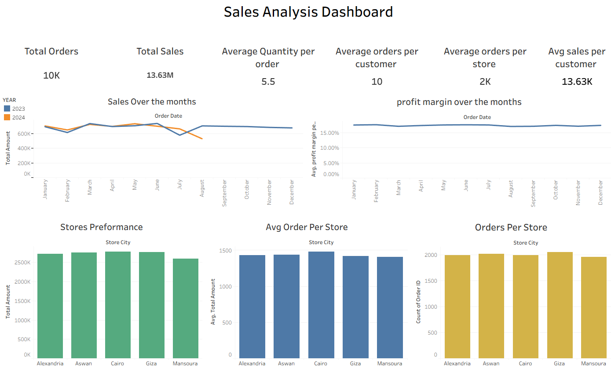

# 📊 Business Data Analysis Project

## 🎯 Objective
The goal of this project is to clean, standardize, and analyze business sales data to provide actionable insights for improving business performance. The project includes:
- 🧹 Cleaning and standardizing the data
- ⚠️ Handling missing or inconsistent data
- 📈 Creating interactive dashboards in Tableau to visualize revenue, profit margins, and best-selling products
- 💡 Drawing recommendations to improve decision-making

---

## 🛠️ Tools & Technologies Used

### Data Cleaning & Preparation
- **Microsoft Excel** - Primary data manipulation and initial analysis
- **Power Query** - ETL (Extract, Transform, Load) processes
- **Data Transformation** - Trim, Replace Values, Data Type detection
- **XLOOKUP** - Category standardization and data enrichment

### Data Analysis & Visualization
- **Tableau** - Interactive dashboard creation and data visualization
- **Statistical Analysis** - Correlation analysis, trend identification
- **KPI Calculation** - Performance metrics and business intelligence

### Data Management
- **Data Validation** - Duplicate removal and consistency checks
- **Null Handling** - Strategic management of missing data
- **Data Standardization** - Format unification and categorization

---

## Step 1 — 🧹 Data Cleaning and Transformation (Excel & Power Query)

### 1.1 Managing Duplicates
- Using Power Query's Remove Duplicates, ~40 duplicate records were identified and removed.
- Columns were carefully checked to ensure no duplicates remained. ✅

### 1.2 Standardizing and Transforming Data

**📅 Order Date Column:**
- Dates were in inconsistent formats (e.g., 4/5/2023 and Jan 07 2023).
- Corrected using Power Query → Detect Data Type → Date.

**🆔 Order ID Column:**
- Inconsistent IDs were standardized by creating a new sequential Order ID column.

**👤 Customer Column:**
- No transformation required.

**🎁 Product Name Column:**
- Inconsistent naming (e.g., hats, hatS, hats ) was fixed using Trim and Replace Values.
- Capitalization and extra spaces were standardized.

**💰 Unit Price & Total Amount Columns:**
- Zeros in Unit Price and Total Amount were converted to blanks to represent missing data accurately.

**📂 Category Column:**
- Product categories were inconsistent.
- Items were categorized into four main categories using a lookup table with XLOOKUP.

### 1.3 Handling Nulls
- Remaining nulls are in: Total Amount, Unit Price, and Profit Margin.
- These were kept as nulls to avoid skewing the analysis.

---

## Step 2 — 📊 Analysis Questions

The analysis addressed the following:

- **KPIs:** Total Orders, Avg Quantity, Total Sales, Number of Stores, Avg Order Value, Avg Orders per Customer
- **📈 Trends:** Sales over the months
- **🏆 Product Performance:** Top-selling products by quantity and sales
- **📂 Category Performance:** Top-selling categories by quantity and sales
- **🏪 Store Performance:** Best and worst performing stores
- **💳 Customer Insights:** Favorite payment methods
- **🔄 Returns Analysis:** Returned vs non-returned orders, products with highest return %, monthly return rate
- **💵 Profitability:** Products with best average profit margin, category profit margin
- **🔗 Correlation:** Between Price and Return Rate
- **📈 Profit Margin Trend:** Average profit margin over time

---

## Step 3 — 🖥 Dashboard Design (Tableau)

### Dashboard 1 — Executive Overview

- **Top:** 6 KPI cards (Total Orders, Total Sales, Avg Quantity, etc.)
- **Charts:**
  - Bar charts for store performance 🏪
  - Line chart for sales over time 📈
  - Line chart for profit margin trend 💹

### Dashboard 2 — Product & Returns Analysis

- **Charts:**
  - Pie charts for category sales percentage 🥧
  - Bar charts for top-selling and most profitable products 🛍
  - Line chart for monthly return rate 🔄
  - Pie chart for returned vs non-returned orders 🔁
  - Column chart with color grading for correlation between price and returns 🎨

---

## Step 4 — 🔍 Insights & Recommendations

### Key Insights
- 📈 Sales showed a huge increase in July, slight dip in August (month not over yet)
- 💵 Profit margin remained flat (~17% across products)
- 🏆 Cairo store leads in sales but not total orders
- ⚠️ Mansoura store is lowest in orders, sales, and average order value
- 👗 Accessories and Clothing dominate sales (~80% of total)
- 👖 Jeans are the best-selling product, 👟 Shoes are the least
- 🔄 ~25% of orders are returned → concerning high return rate
- ❌ No correlation between higher price and returned orders
- 📅 Monthly return rate spiked in August → needs investigation

### Recommendations
1. **Investigate Returns:**
   - Analyze causes of 25% return rate, especially August spike 🔎

2. **Improve Low-Performing Stores:**
   - Focus on marketing, promotions, or operational improvements in Mansoura 🏪

3. **Optimize Product Offerings:**
   - Promote high-performing products (Jeans, Accessories) and reduce low-performing ones (Shoes) 🛍

4. **Enhance Profit Margins:**
   - Explore ways to improve profit margins for low-performing products 💵

5. **Seasonal Planning:**
   - Prepare for peaks like July with inventory and marketing campaigns 📅

6. **Leverage Customer Insights:**
   - Use preferred payment methods for targeted promotions 💳

